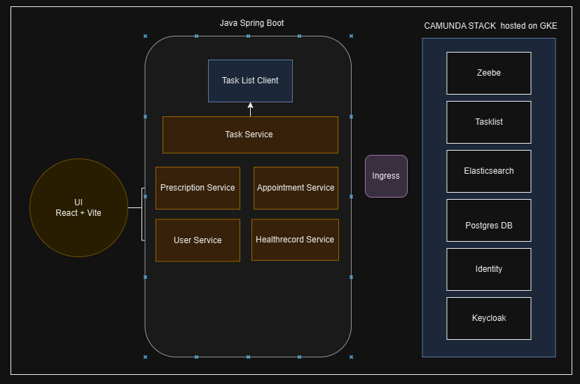
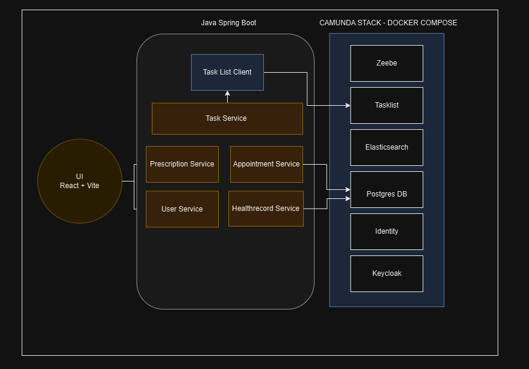

# Self-hosting Camunda 8

This project provides an easy way to self-host Camunda 8 with all services and a custom UI.

## Project description

Shortly said this project is about self hosting camunda 8.

Camunda is an open-source platform designed for workflow automation and business process management. It helps organizations model, execute, and monitor processes using visual workflows. These workflows can represent various business activities, such as approving requests, handling customer interactions, scheduling tasks, or integrating with different systems.

At its core, Camunda uses BPMN (Business Process Model and Notation), a standardized way of modeling processes, which makes it easier for both technical and non-technical users to design workflows. Once a workflow is deployed, Camunda’s engine takes care of executing the process, ensuring each step is completed as defined, and managing tasks that involve both automated steps and human input.

Camunda also provides tools for real-time monitoring and reporting, allowing users to track the progress of processes, identify bottlenecks, and optimize workflows over time. Its flexibility makes it suitable for a wide range of industries, including finance, healthcare, logistics, and more.

By self-hosting Camunda, we aim to leverage its powerful features while maintaining full control over customization, integration, and data privacy.

We want to demonstrate how camunda can be integrated in an application. Therefore we developed a Application that can be used in the healthcare area. E.g. the application allows you to manage patient data, including personal information, prescriptions, and medical history. 

The system is designed with a frontend application that interacts with a self-hosted Camunda instance to manage and trigger these processes. By integrating Camunda into the system, the aim is to automate complex workflows, reduce manual intervention, and ensure consistent handling of patient-related tasks.

## Project Architecture

There are multiple ways of solving the given problem of self hosting a Camunda 8 instance. The optimal way would be hosting it using a Kubernetes cluster. This allow a great flexibility and scalibility, briefly summarized you have a lot of options and Control over the camunda instance. This would mean we install camunda in our cluster using their officialy distributed helm charts. On top of that we deploy our ui and backend that interact with the camunda instance. We also use camundas built-in User management with keycloak.

The alternative would be using docker compose. Camunda also provides a official preconfigured docker-compose yaml that starts all services as docker container. This solution is not really efficient in the prodution environment but we think it is great to demonstrate the communication between the containers or the camunda features in general, in the next steps you could then migrate to kubernetes.

## Project Retrospective

This section deals about how we solved the problem, and which descisions we made. With look at the beginning the requirement was to use kubernetes. We took that approach and deployed the camunda stack with helm in a local minikube cluster. Then we created the helm charts for our backend and frontend. This required us also to create a automated workflow that pushes our docker images in the Github Container Registry. The created helm charts are located in the `helm` folder.After a while we saw that the kubernetes cluster claims a lot of ressources so we moved on and tested the camunda self hosted stack with docker compose, like shown in the project architecture section.

To get Camunda up and running, we had to use the official Docker Compose YAML file and configure it for our needs. There is already a pre-configured values.yaml. We also wrote shell scripts that are necessary to start the application. For example, the Spring services need to be built and started, and the Docker containers also need to be launched.

To successfully start the Docker containers, local environment files must be set up. The secrets are not committed to the repository. The UI includes a user management system that is integrated with Keycloak. To set this up properly, the UI application must be registered in the Identity service. In order for Keycloak to work correctly, the resolve_keycloak.sh script must also be executed.

## Installation

The [Installation guide]('/INSTALLATION.md') outlines all the steps required to set up and run the program locally.

## License

This project is licensed under the MIT License - see the [LICENSE](LICENSE) file for details.
